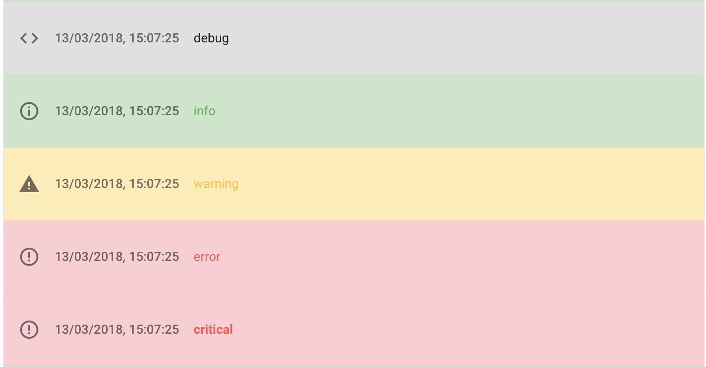

# Getting started

## Install django-carrot


Install with *pip*

```bash
pip install django-carrot
```

### Install RabbitMQ

Install and start RabbitMQ:

```bash
brew install rabbitmq
brew services start rabbitmq
```
    

### Configuring your Django project

1. Add carrot to your Django project's settings module:

```python
INSTALLED_APPS = [
    #...
    'carrot',
]

```

2. Apply django-carrot's migrations them to your project's database:

```bash
python manage.py migrate carrot
```
    

For see all configuration options, refer to :ref:`carrot-settings`

### Starting the service

Once you have configured django-carrot, you can start the service using the following django-admin command:

```bash
python manage.py carrot_daemon start
```

The daemon can be stopped/restarted as follows:


```bash
python manage.py carrot_daemon stop
python manage.py carrot_daemon restart
```

For the full set of options, refer to [admin-command](service.rst)

### Creating and publishing tasks


While the service is running, tasks will be consumed from your RabbitMQ queue. To test this, start the django shell:

```bash
python manage.py shell
```

And use the provided helper, ``carrot.utilities.publish_message``:

```python
from carrot.utilities import publish_message

def my_task(**kwargs):
    return 'hello world'

publish_message(my_task, hello=True)
```


The above will publish the :code:`my_task` function to the default carrot queue. Once consumed, it will be
called with the keyword argument *hello=True*

### Task logging

In order to view the task output in :ref:`monitor`, you will need to use Carrot's logger object. This is done
as follows:


```python
from carrot.utilities import publish_message
import logging

logger = logging.getLogger('carrot')

def my_task(**kwargs):
    logger.debug('hello world')
    logger.info('hello world')
    logger.warning('hello world')
    logger.error('hello world')
    logger.critical('hello world')

publish_message(my_task, hello=True)
```

This will be rendered as follows in the carrot monitor output for this task:




> By default, Carrot Monitor only shows log entries with a level of *info* or higher. The entry logged with
  `logger.debug` only becomes visible if you change the **Log level** drop down


### Scheduling tasks

Scheduled tasks are stored in your Django project's database as **ScheduledTask** objects. The Carrot service will
publish tasks to your RabbitMQ queue at the required intervals. To scheduled the **my_task** function to run every 5
seconds, use the following code:

```python
from carrot.utilities import create_scheduled_task

create_scheduled_task(my_task, {'seconds': 5}, hello=True)
```

The above will publish the **my_task** function to the queue every 5 seconds

Tasks can also be scheduled via the :ref:`monitor`


## The Carrot monitor


Carrot comes with it's own monitor view which allows you to:
    - View the list of queued tasks
    - View the traceback of failed tasks, and push them back into the message queue
    - View the traceback and output of successfully completed tasks

To implement it, simply add the carrot url config to your Django project's main url file:

```python
urlpatterns = [
    #...
    url(r'^carrot/', include('carrot.urls')),
]
```

For more information, refer to [the carrot monitor](/monitor.html)

## Docker

A sample docker config is available [here](https://github.com/chris104957/django-carrot-docker)

## Support

If you are having issues, please [Log an issue](https://github.com/chris104957/django-carrot/issues/new)

## License

The project is licensed under the Apache license.
