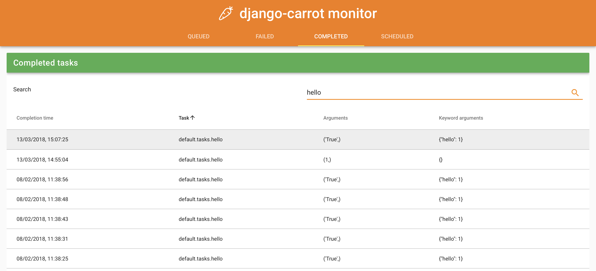

# release notes


## 1.3.0

- #96: Add purge button to the monitor
- #95: Adding validation to create_scheduled_task
- #95: Fixing versioning issues

## 1.2.2

- #91: task_name missing in create_scheduled_task

## 1.2.1

- #87: Migration error in migration 0003

## 1.2.0

- #81: Carrot monitor breaks when the queue from a completed message log gets removed from the config
- #79: Add unique task_name field to ScheduledTask object
- #78: Carrot service should warn users when process is already running
- #77: Update the docs to make it clear tasks must be published from within the Django context

> This release contains new migrations. In order to upgrade from a previous version of carrot, you must apply them 
  first with `python manage.py migrate carrot`

## 1.1.3

- #75: Add a link to the docker container sample to the docs

## 1.1.2

- Doc updates

## 1.1.1

- #72: Migrations end up inside venv?


## 1.1.0

- #56: Have Django host VueJS resources instead of CDN
- #66: Switching between monitor views quickly shows tasks in the wrong list
- #67: Simply the version management
- #68: Simplify the readmes

## 1.0.0

### Monitor material theme

Added a material theme to the django-carrot monitor:




### Failure hooks

Implemented failure hooks, which run when a task fails. This can be used to re-queue a failed task a certain number
of times before raising an exception. For example:


`my_project/my_app/consumer.py`

```python
from carrot.utilities import publish_message

def failure_callback(log, exception):
    if log.task == 'myapp.tasks.retry_test':
        logger.critical(log.__dict__)
        attempt = log.positionals[0] + 1
        if attempt <= 5:
            log.delete()
            publish_message('myapp.tasks.retry_test', attempt)


class CustomConsumer(Consumer):
    def __init__(self, host, queue, logger, name, durable=True, queue_arguments=None, exchange_arguments=None):
        super(CustomConsumer, self).__init__(host, queue, logger, name, durable, queue_arguments, exchange_arguments)
        self.add_failure_callback(failure_callback)
```


`my_project/my_app/tasks.py`

```python
def retry_test(attempt):
    logger.info('ATTEMPT NUMBER: %i' % attempt)
    do_stuff() # this method fails, because it isn't actually defined in this example
```

`my_project/my_project/settings.py`

```python
CARROT = {
    'default_broker': vhost,
    'queues': [
        {
            'name': 'default',
            'host': vhost,
            'consumer_class': 'my_project.consumer.CustomConsumer',
        }
    ]
}
```

### Bug fixes

- #43: During high server load periods, messages sometimes get consumed before the associated MessageLog is created